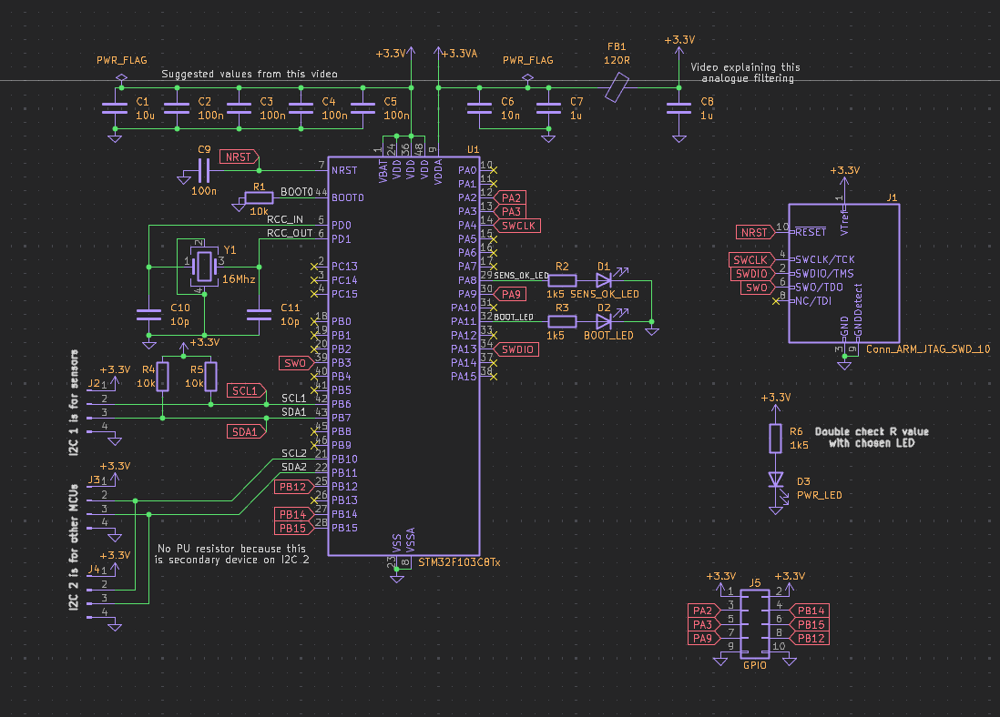
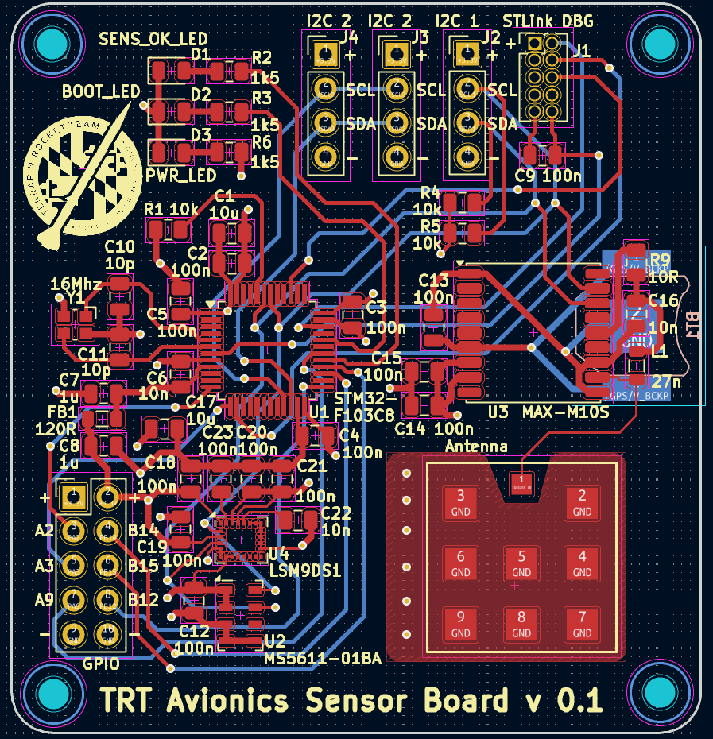
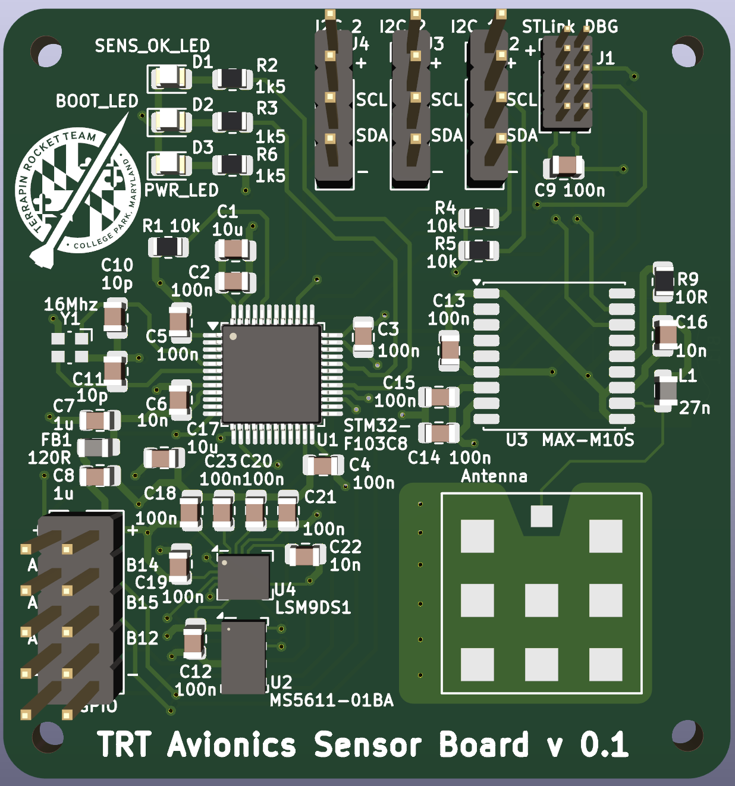
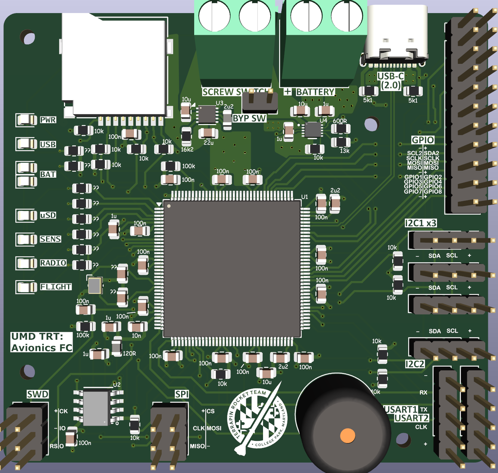
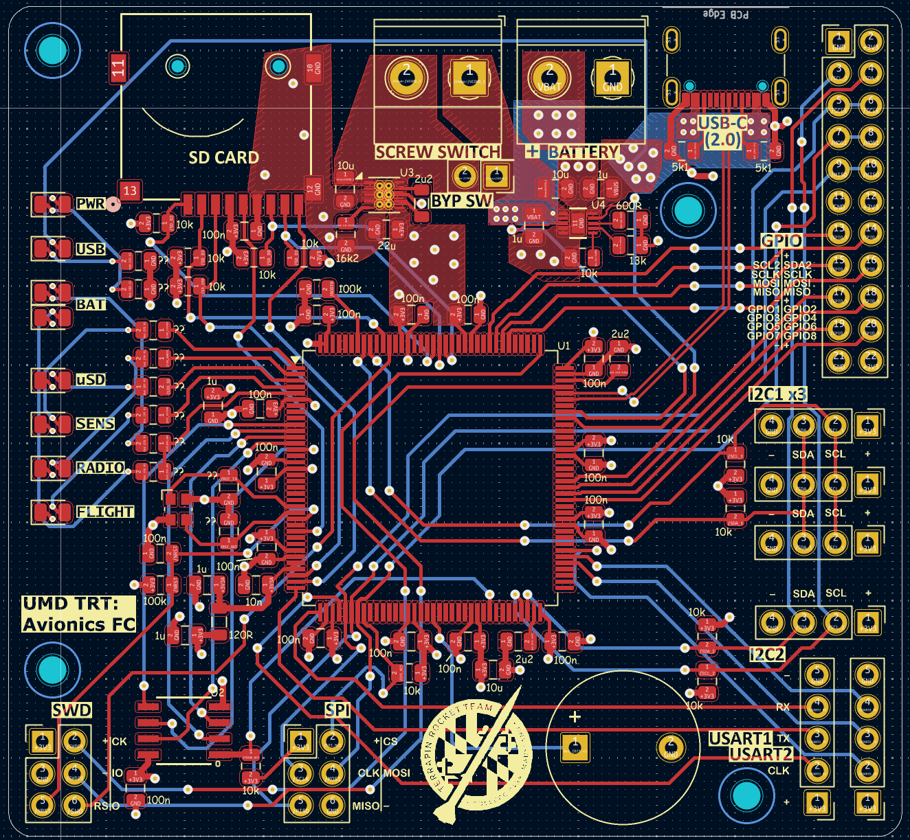
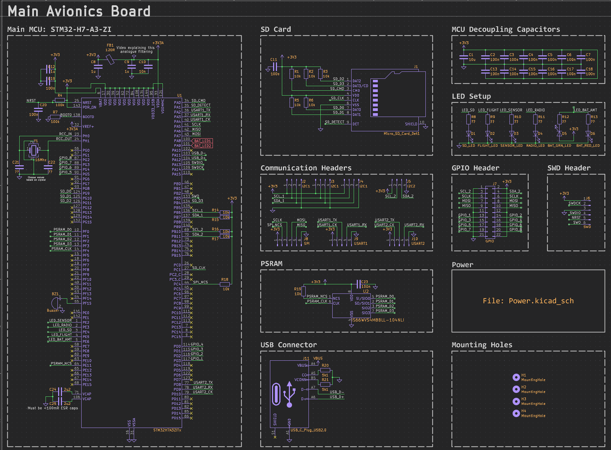
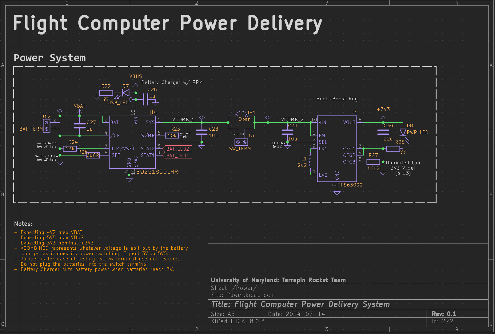

## Intro

### All files are located on the `new-pcbs` branch under `Spaceport\24-25\PCBs`.

After the meeting in early July, I wanted to play around designing PCBs because I thought it would be pretty neat. Before this exercise, I knew absolutely nothing about the subject. Everything I learned, I learned from Phil's lab.

[Video #65 specifically](https://www.youtube.com/watch?v=aVUqaB0IMh4).

This 2 part video set was also helpful. [Part 1](https://www.youtube.com/watch?v=nkHFoxe0mrU) & [Part 2](https://www.youtube.com/watch?v=PlXd3lLZ4vc).

**I am hoping to show some proof-of-concept designs to indicate a direction I think we should go as we move towards STM32. Besides the fact that I know nothing about PCB design, there are a few times when I intentionally left a part unfinished or chose a part at random because I just wanted to get the idea across. I am definitely looking for feedback, and the subteam as a whole should have a conversation about desired features and part selection.**

Going into this, I wanted to do multiple PCB parts instead of one large board because I figured that would make fitting everything together in the FC easier. Smaller individual components can more effectively stack to use 3D space than one large plane. My original goal was to have 4 boards:

1. Main board
2. Power board
3. Sensor board
4. Radio board

I figured that keeping the radio and sensors separate would help with RFI. The power board was intended to be a central source for power for the entire Airbrake assembly, rather than the four separate battery types that would be used if we do the same thing as last year. Before I started though, Airbrake noted that they were going to manage their own power again this year, so I scrapped the power board idea and focused on the other three.

## Sensor Board

I started with this board, as Varun had asked me to pick out new sensors to replace the BMP and BNO. After only some preliminary research, I decided to prototype with the MS561101BA03-50 Barometer ([Datasheet](https://www.te.com/commerce/DocumentDelivery/DDEController?Action=showdoc&DocId=Data+Sheet%7FMS5611-01BA03%7FB3%7Fpdf%7FEnglish%7FENG_DS_MS5611-01BA03_B3.pdf%7FMS561101BA03-50) & [DigiKey](https://www.digikey.com/en/products/detail/te-connectivity-measurement-specialties/MS561101BA03-50/5277445?utm_adgroup=Sensors%20%26%20Transducers&utm_source=google&utm_medium=cpc&utm_campaign=Dynamic%20Search_EN_Product&utm_term=&utm_content=Sensors%20%26%20Transducers&utm_id=go_cmp-120565755_adg-9159613635_ad-410985234921_dsa-118454329515_dev-c_ext-_prd-_sig-Cj0KCQjwkdO0BhDxARIsANkNcrdcpPqtRmxhnYtq9-W6od6ChwqzpoLl9-sPUKmT_l8SlIeKF7FuekMaAt1XEALw_wcB&gad_source=1&gclid=Cj0KCQjwkdO0BhDxARIsANkNcrdcpPqtRmxhnYtq9-W6od6ChwqzpoLl9-sPUKmT_l8SlIeKF7FuekMaAt1XEALw_wcB)). It allegedly has better EMI protection than the BMP390, although it is more expensive. For the IMU, I chose the LSM9DS1 9-DOF IMU ([Datasheet](https://www.digikey.de/htmldatasheets/production/1639232/0/0/1/lsm9ds1-datasheet.html) & [DigiKey](https://www.digikey.com/en/products/detail/stmicroelectronics/LSM9DS1TR/4988083)).

The MCU on the sensor board is the STM32F103C8T6 ([Datasheet](https://www.st.com/resource/en/datasheet/stm32f103c8.pdf)). I chose this because Varun said that we had already ordered this and another more powerful version of the STM32. I figured that I would use the more powerful one on the main board and the less powerful one on the sensor board. It is intended to communicate with the main board over I2C.

Here is an image of the schematic for the sensor board, although I recommend looking at the actual file in the repository for a better view.

As this is the first PCB I have ever designed, I am sure that there are many mistakes. I would appreciate any feedback on how to improve this design. Of course, if you have any questions, I can answer those too.

Here is the PCB itself:

Again, please look at the real files and give me any feedback you have. I am sure that there are many mistakes in this design (and errors I didn't feel like fixing, like the size difference of the STLink header).

## Main Board

This is the second PCB I designed. The idea was to create a centralized hub that all peripheral boards would communicate with over I2C. Originally, I was going to implement a custom STLink debugger on this board, similar to how the STM Nucleo boards do. That would make it plug-and play like the teensy where we could upload and debug straight from a single USB port. During design, however, I ran into multiple issues with power management, as we also wanted built-in battery charging and the STLink part would only negotiate for 300mA from the USB host. I decided to scrap the STLink part and focus on the power management and I2C communication.

I'll start with the PCB first this time, as I think it better showcases the idea behind the board.

Unfortunately I forgot about the mounting holes until the end, so you can see they are a bit all over. This board was a bit harder than the other one because it includes battery charging and power switching. I also had to design my own uSD card slot in order to have a complete 3D model set lol.

Once again, much of this is a proof of concept. I wasn't worried about the actual connection types (using pin headers instead of JST or similar, for example). I just wanted to get the idea across.

Here are the other images:

As you can see, I left space for a lot of IO pins. Again, this is supposed to be a "hub" kind of board, managing multiple peripherals.

Some notes:

- The BYP SW is a jumper intended to make it easier to test. Just connect/disconnect the jumper to power on/off. When we get to mounting it in the rocket, simply remove the jumper and the screw switch will work instead.
- The `??` resistors are because I had not chosen LEDs, and so didn't know how much current limiting I would need.
- Due to space constraints, I left out the actual identifier in the Silkscreen, opting to only have the value instead.
- I chose USB 2.0 mostly because that's as high as the MCU supports.
- The three I2C1 headers relate to them all being parallel on the I2C1 bus. This is the bus intended to communicate with the other boards. If we need another bus, there are two I2C2 headers (one in the GPIO collection)
- The schematic has links to the datasheets for all the parts I chose

## Wrap-up

I am looking for help reviewing the design and part choices that I made during this process. I have a number of recommendations after doing this exercise:

- We should use JST connectors as they seem to be pretty secure, and we have a lot of them.
- We should decide what kind of LED output we want. I picked some mostly random outputs, but if we have specific things we want to keep track of, we should put an LED there.
- We definitely should discuss parts we want to use. I did some research and picked ones I thought would be reasonable, but they should definitely be double-checked.